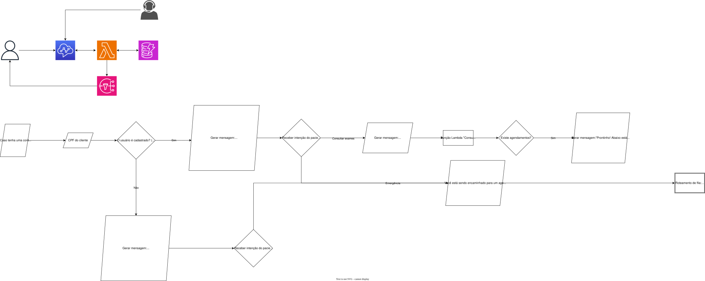

# 🏥 Call Center Inteligente - Hospital São Bueno

Projeto de autoatendimento e call center serverless para o hospital fictício **São Bueno**. A solução integra telefonia inteligente, microsserviços e banco de dados para automatizar o atendimento ao paciente, consulta de agendamentos e validação de cadastro, resultando num atendimento humanizado e eficiente ao paciente.

---

## 🛠️ Arquitetura e Tecnologias

A solução utiliza os seguintes serviços da **Amazon Web Services (AWS)**:

* **Amazon Connect:** Gerenciamento de chamadas, URAs inteligentes e fluxos de atendimento ao paciente.
* **AWS Lambda:** Execução da lógica de negócios sem servidor (validação de dados, consultas e integração).
* **Amazon DynamoDB:** Banco NoSQL para busca rápida de pacientes e agendamentos.
* **Amazon SNS (Simple Notification Service):** Envio de notificações, confirmações e alertas via SMS/E-mail.

---

## 📐 Diagrama da Solução

O fluxo de atendimento da URA / Bot está estruturado da seguinte forma:

---

## 💻 Como Rodar / Testar (Em breve)

Ao finalizar o projeto, será inserido as informações de como realizar o deploy para testes no seu próprio ambiente.